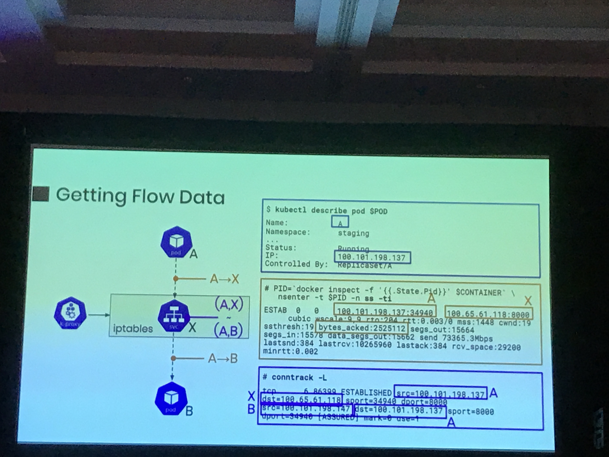
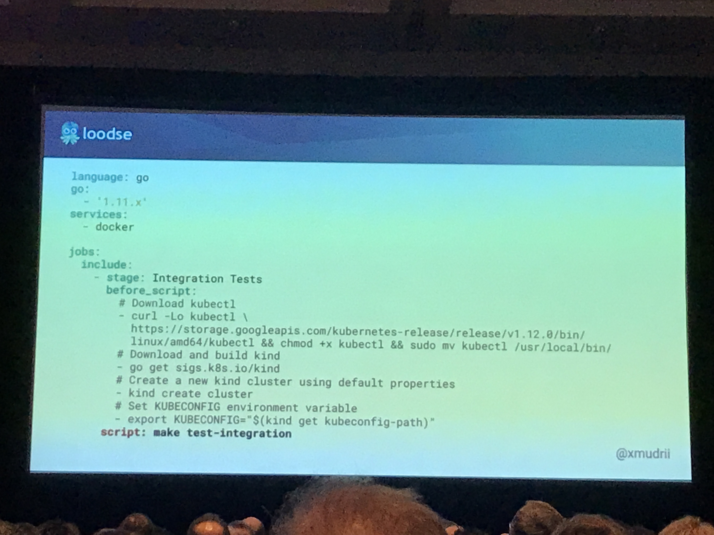
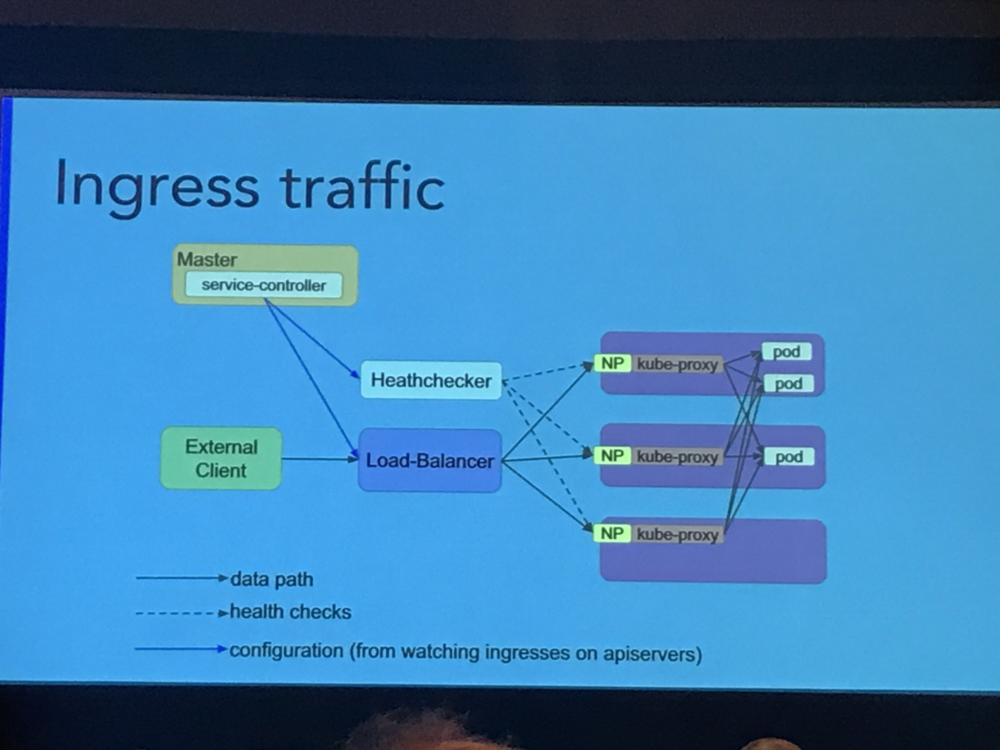
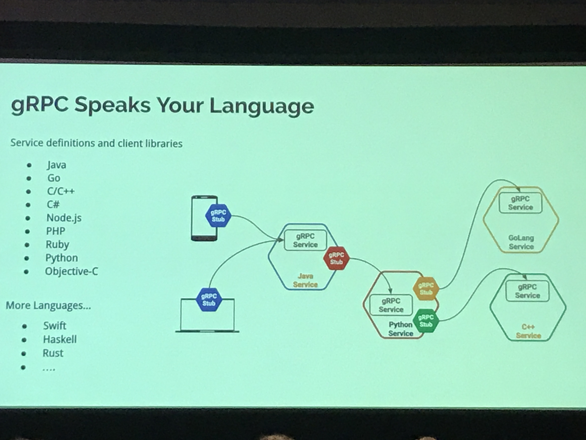
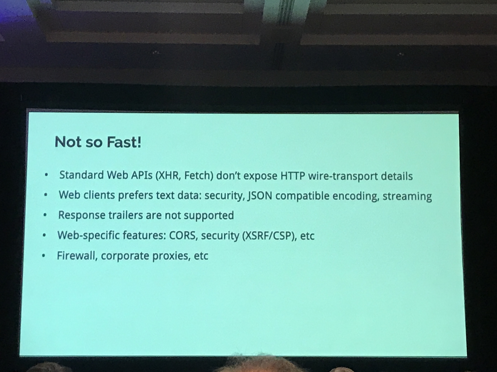
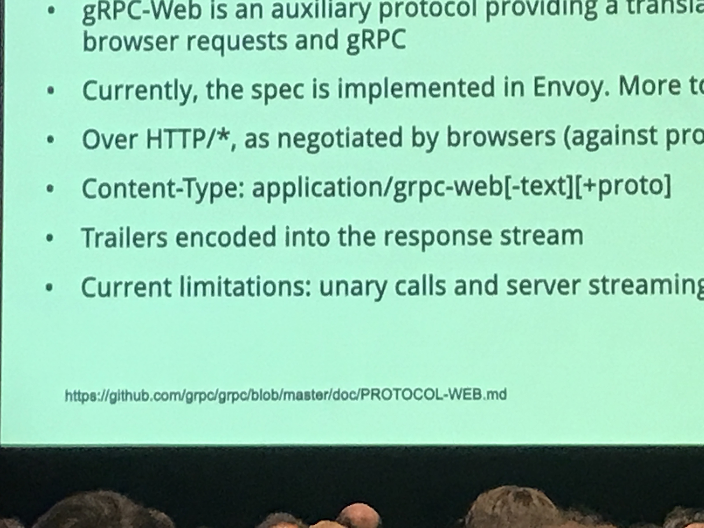

## GitOps: Ubie Inc by @sakajunquality
- Check weaveworks for GitOps def
two repositories basically, 
- Application repo and
- Config repo

- Workflow should be simple
- Repo should be decoupled

## ChatBot from Capital Bank by Andrew
- Chatbots are simple req -> res architecture
- they are language and platform agnostic

## CRDs aren't just for Addons: by Tim (Principle eng in Google)
- can add admission controls with webhooks for CRD
- can define schema thru apis

##### Recently 
- RuntimeClasses are defined in CRDs for apiserver
- PVs are  defined in CRDs for apiserver

## Labels in Prometheus Alerts: Think Twice Before Using Them - Elena Morozova, Weaveworks @lelenanam
- common annotations

## Behind The Scenes: Kubernetes Release Notes Tips & Tricks - Mike Arpaia, Kolide @marpaia
- add "none" if you don't have any note for pr in k8s repo

## Monitoring Kubernetes with BPF and Prometheus - Jonathan Perry, Flowtune by @
**Flow analysis server**
- Flow monitoring
- Technology: eBPF

- with flow data, complete arch data can be achieved.
- can find the easily the health of the upstream services
- Monitor the services using the expensive resources.
www.flowmill.com

## Spawning Kubernetes In CI For Integration Tests - Marko Mudrinić, Loodse
- sigs k8s in docker => sigs.k8s.io/kind
- KIND:
    - Only req is docker
    - comes pre-build docker image containing all dependencies
    - clusters are provisioned using kubeadm

##### KIND in Travis CI:
- kind create cluster will create cluster
- GitHub: xmudrii/travis-kind

## Running Kubernetes in the Federal Government - John Osborne, `Red Hat`
- http://atopathways.redhatgov.io/

## Optimizing Kubernetes Networking at Datadog - Laurent Bernaille, Datadog
- lyft CNI plugin

## Connect from Browsers Using gRPC-Web - Stanley Cheung, Google

## How You Too Can Find a Needle in the Haystack - Shreya Sharma, Expedia Inc.
- https://github.com/ExpediaDotCom/haystack
- three ids for identification
    - trace id
    - span id: identifies the txns
    - parent span id: help identify whi talks to whom.

## The Future of Humans in a World of Automation - Kendall Miller, ReactiveOps by @blatanterror
- keep calm and automate on

## 